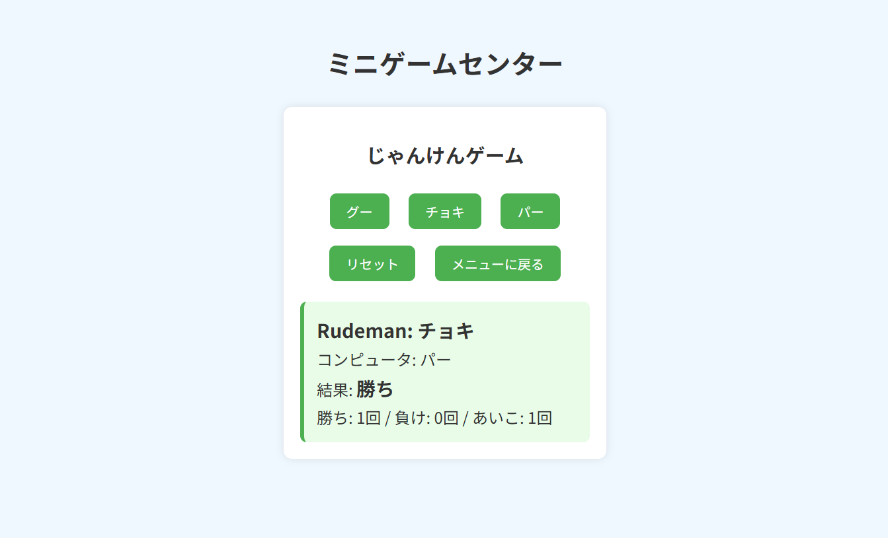
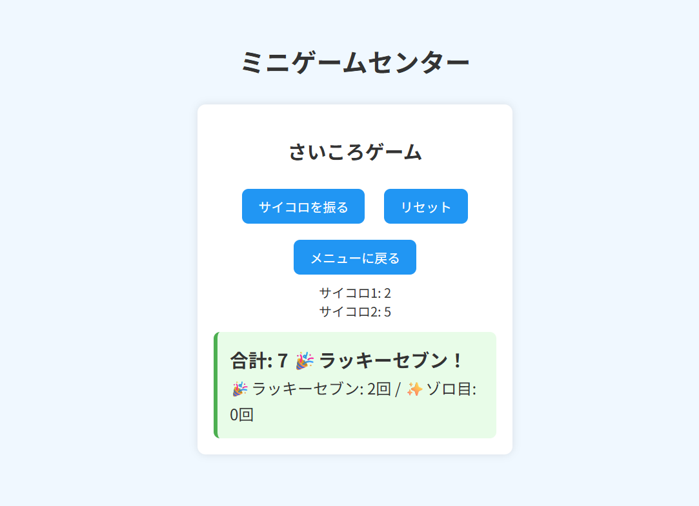
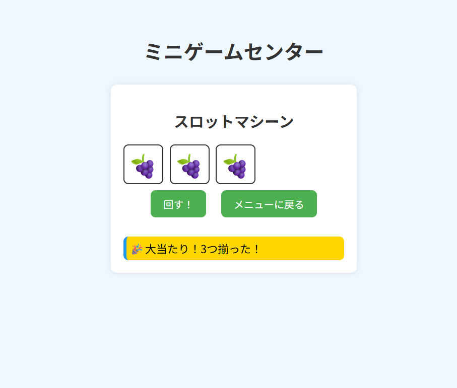

# 公開ページ
↓　ゲームはこちらから遊べます　！↓

https://taxintian-cloud.github.io/min-gamecenter/

# Webゲームコレクション

このプロジェクトは、ブラウザ上で気軽に遊べるミニゲーム集です。
名前入力⇒メニュー画面⇒3種類のゲームを選んで遊べます。

## 🎮 含まれるゲーム
- じゃんけんゲーム
- サイコロゲーム（アニメーション付き）
- スロットマシーン（固定リール方式・光演出あり）

- UIやアニメーションにもこだわり、
- 「遊んでいて気持ちいい」体験を目指しています。

## 🎮 スクリーンショット

### ✊ じゃんけんゲーム

### 🎲 サイコロゲーム

### 🎰 スロットゲーム

## 🎮 それぞれの特徴
1．じゃんけんゲーム
・シンプルでわかりやすい
・勝敗履歴を自動でカウント
・結果に応じて背景色が変わる演出
2．サイコロゲーム
・サイコロが揺れるアニメーション付き
・ラッキーセブンやゾロ目の特別演出
・履歴カウントで遊び続けたくなるような仕組み
3．スロットマシーン
・固定リール方式で本物のスロットに近い挙動
・高速回転⇒リセット⇒減速⇒停止の自然な流れ
・停止時のバウンド演出
・当たり時の光エフェクト
・コード構造がシンプルで拡張しやすい設計

## 🛠 使用技術
- HTML
- CSS（アニメーション、UIデザイン）
- JavaScript（DOM操作、アニメーション制御、ゲームロジック）

## ✨ 工夫したポイント
- 1．UI/アニメーション面の工夫
- 　リールの回転速度や停止タイミングを細かく調整し、実機のような自然な動きを再現
- 　停止時のバウンドアニメーションで「止まった感」を演出
- 　当たり時の光エフェクトをCSSで実装し、視覚的な気持ちよさを追求
- 　ボタンや画面遷移にフェード効果を入れて、アプリらしい滑らかさを実現
- 　スマホでも見やすいようにレイアウトを調整（レスポンシブ対応）
- 2．ゲームロジック面の工夫
- 　スロットは「固定リール方式」を採用し、ランダムではなく"実際に回って止まる挙動を実装"
- 　サイコロはランダム値だけでなく、揺れるアニメーションを加えてリアル感を強化
- 　じゃんけんの勝敗判定をシンプルなロジックで実装し、読みやすさと拡張性を両立
- 　各ゲームの履歴カウントを実装し、遊び続けたくなる仕組みを追加
- 3．コード構造・設計面の工夫
- 　HTML/CSS/JSを分離し、読みやすく保守しやすい構造に整理
- 　関数ごとに役割を分け、後から機能追加しやすいように設計
- 　アニメーションの開始・停止を管理するためのフラグを導入
- 　同じ処理を複数回書かないように、共通関数を作ってコードを最適化
- 　コメントを丁寧に入れて、初めて見る人でもお理解しやすいように工夫
- 4．ゲーム全体の体験面の工夫
- 　名前入力⇒メニュー⇒ゲーム選択という流れで"アプリ感"を演出
- 　3つのゲームをひとつの世界観で統一し、遊びやすいUIに
- 　結果に応じて背景色や演出が変わることで、視覚的なフィードバックを強化
- 　ボタン配置やサイズを調整し、直感的に操作できるように設計

## 今後のアップデート予定
・スロットの役を増やす
・効果音の追加
・スマホ向けのUIの最適化
・新しいゲームの追加

